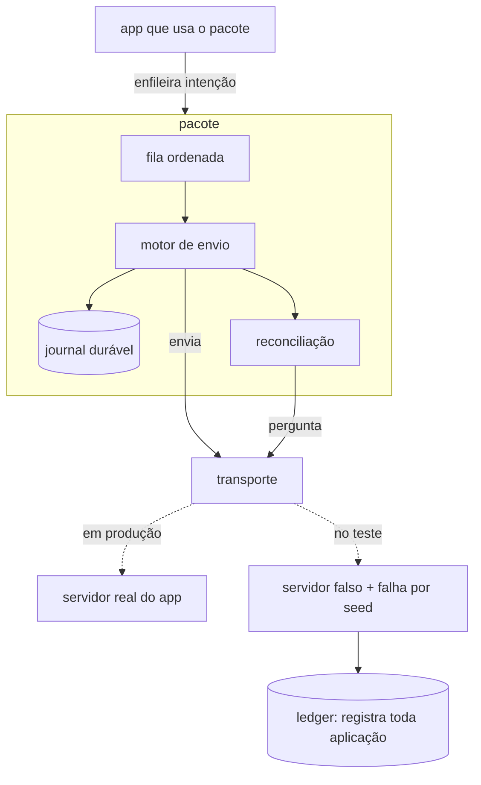

# Arquitetura

## O limite do sistema

O pacote roda **dentro do app**. Ele não é serviço, não abre porta e não fala
com nada sozinho: recebe uma intenção, garante que ela vira exatamente um efeito
do outro lado, e devolve um desfecho.



**Atores externos:** o app que depende do pacote, o servidor do app (fora do
escopo deste repositório) e o sistema operacional, que decide quando a tarefa de
background roda — e quando ela morre.

## Componentes e o que cada um responde

| Componente | A pergunta que ele responde |
|---|---|
| **Intenção** | qual é a identidade *de negócio* desta operação, e qual chave estável sai dela |
| **Journal** | o que foi registrado antes de sair, e em que estado está |
| **Fila** | qual é a próxima, e a ordem se manteve? |
| **Motor de envio** | tentar, interpretar o desfecho, decidir entre reenviar e perguntar |
| **Reconciliação** | o que o servidor fez, já que a resposta se perdeu |
| **Transporte** | a fronteira injetável: em produção é rede, no teste é falha determinística |
| **Servidor falso** | contrato de idempotência: replay, conflito de chave, requisição em voo, expiração de chave |
| **Ledger** | quantos efeitos existiram de verdade — **registra tudo, nunca deduplica** |

## O contrato, em esboço

Não é a API final — é a **forma** que a implementação precisa preservar, para a
próxima sessão não inventar outro desenho. Se algo aqui não couber, mude aqui
antes de mudar no código.

**Identificadores em inglês, prosa em português.** Decidido em 29/08/2026, pelo
dono, e registrado aqui porque a versão anterior deste esboço estava em
português. O motivo é o `Como se sabe que deu certo` do `PROJECT.md`: o sucesso
deste repositório é alguém que o dono não conhece executar o artefato ou dar um
contra-argumento técnico a ele, e esse público — sistemas distribuídos,
idempotência, pub.dev — lê em inglês. A documentação continua em português
porque ela explica o raciocínio para quem trabalha aqui; a API é a superfície
que um estranho toca.

```dart
// o app configura uma vez
final outbox = Outbox(
  transport: MeuTransporte(),   // o app implementa: fala com o servidor dele
  storage: SqliteStorage(),     // camada 2; a camada 1 usa InMemoryStorage
);

// e submete uma intenção, não uma requisição
final result = await outbox.submit(
  Operation(
    reference: 'transfer-8f3a91',           // identidade de negócio, estável
    payload: {'from': ..., 'to': ..., 'amountInCents': 15000},
  ),
);

switch (result) {
  Settled(:final effectId) => ...,   // aconteceu, uma vez, e dá para rastrear
  Rejected(:final reason)  => ...,   // o servidor recusou, e não houve efeito
  Queued()                 => ...,   // sem rede; está no journal, na ordem
  Undetermined()           => ...,   // destino desconhecido; recover() resolve
}

// no start do app, e na janela de background
await outbox.recover();
```

**O que o app nunca faz**, e é o produto inteiro: não gera chave de idempotência,
não escreve retry, não decide o que um timeout significa, não trata morte de
processo.

**As duas interfaces que o app implementa ou escolhe:**

| Interface | Responsabilidade | Quem implementa |
|---|---|---|
| `Transport` | mandar a requisição e responder o que o servidor disse; expor consulta por chave e por referência | o app, em produção; o pacote, no teste |
| `Storage` | guardar journal e fila de forma durável e ordenada, em transação | o pacote: em memória na camada 1, SQLite na 2 |
| `OutboxLock` | impedir que dois motores esvaziem a mesma fila ao mesmo tempo | o pacote: `NoLock` na camada 1, `SqliteLease` na 2 |

**`OutboxLock` entrou na camada 2, em 29/08/2026, e o motivo é uma medição.**
Dois `recover()` concorrentes sobre a mesma fila de três operações produziram
**seis envios**. O efeito não duplicou — as duas instâncias mandam a mesma
chave, e o servidor deduplica —, mas cada operação saiu duas vezes na rede.

Isso não é desperdício acadêmico. No iOS o orçamento de execução em background é
finito e o sistema pune quem o gasta à toa, então trabalho duplicado na janela
de background vira janela negada na próxima vez. O lock protege **a ordem e o
estado local**, como `docs/TESTING.md` já dizia, e também o orçamento.

O lease **expira**, e isso é requisito e não conforto: um processo morto não
libera nada, e um lock sem prazo trava o outbox até a próxima reinstalação do
app. O prazo vem do `Clock` injetável, como todo tempo neste pacote.

`Undetermined` **não é falha**. Devolver erro nesse estado é a mentira que vira
cobrança dupla — o registro continua no journal e `recover()` fecha depois.

## As fronteiras que não se cruzam

- **`core/` não importa `package:flutter`.** É o que mantém a camada 1 rodando
  em `dart test`. Persistência e plataforma entram por interface.
- **O journal é do cliente; o ledger é do servidor.** São coisas diferentes com
  nomes parecidos, e trocá-las é o erro conceitual mais provável aqui. O journal
  registra *intenção*; o ledger registra *efeito*.
- **O transporte é o único lugar onde falha é injetada.** Nenhum componente
  simula falha por conta própria.

## As três decisões são peças, não linhas espalhadas

Restrição de desenho que vem do teste, e é a mais importante deste documento.

`docs/TESTING.md` exige **ablações**: clientes idênticos ao correto com uma
decisão trocada, cada um reprovando em cenários específicos. Isso só é possível
se as três decisões forem **peças substituíveis do motor**, e não condicionais
enfiadas no meio do fluxo:

| Decisão | Vira | A ablação troca por |
|---|---|---|
| a chave sai da intenção | uma função `intenção → chave` | uma que usa a tentativa |
| grava antes de enviar | a ordem no motor, num ponto só | inverter as duas linhas |
| timeout e chave expirada terminam no ledger | a política de desfecho | tratar desconhecido como "nada aconteceu" |

Se para escrever uma ablação for preciso **copiar** o motor, o desenho está
errado: ablação copiada não prova nada, porque a cópia diverge do original e o
teste passa a comparar duas coisas diferentes. Ela precisa ser o **mesmo** motor
com uma peça trocada.

O ganho não é só de teste. As três decisões passam a ter nome no código, e a
frase "não mude isto sem decisão explícita" do `AGENTS.md` ganha um lugar onde
ser obedecida — em vez de depender de alguém lembrar por quê.

## Estado do dado

Nada sensível. Contas, valores e referências são sintéticos por construção, e a
persistência local guarda apenas intenção de operação e desfecho — sem
credencial, sem token, sem dado pessoal.

A propriedade é do app hospedeiro: o pacote guarda em SQLite local e não envia
nada para lugar nenhum além do transporte que o app configurou.

## A primeira fatia vertical

Fina, atravessando o sistema inteiro, produzindo evidência. **Comece por ela.**

> Uma operação é enfileirada → o journal grava antes do envio → o envio é feito
> → **a resposta se perde** → a reconciliação pergunta ao servidor → descobre
> que o efeito aconteceu → liquida. **Um efeito no ledger.**

É o cenário 2 de `docs/TESTING.md`. Com ele passando, existe:

- intenção com chave derivada do conteúdo;
- journal em memória, atrás da interface que a camada 2 vai implementar em
  SQLite;
- transporte com um roteiro de falha determinístico;
- servidor falso com contrato de idempotência e ledger que registra;
- a invariante verificável;
- **e o cliente ingênuo reprovando no mesmo cenário** — sem isso a fatia não
  está fechada.

Nada de fila, ordem, persistência, app ou background nesta fatia. Eles entram
depois, um cenário por vez.

## Como as camadas se encaixam, e por que são três pacotes

**A camada 3 mora em `background/`, num pacote próprio.** Decidido em
29/08/2026, na implementação, e o motivo é o critério 2 de `docs/STACK.md`: o
`MethodChannel` vem de `package:flutter`, e um pacote que declara Flutter como
dependência **não roda em `dart test`** — nem para as partes que não usam
Flutter. Manter a camada 3 no pacote principal custaria a suíte headless das
camadas 1 e 2, que é o ativo mais valioso deste repositório.

```text
/            flutter_outbox             camadas 1 e 2 · Dart puro · dart test
background/  flutter_outbox_background  camada 3 · plugin · Kotlin e Swift
example/     outbox_example             o app, que depende dos dois
```

Quem quer só o motor depende de `flutter_outbox`. Quem quer background em
aparelho depende dos dois. `docs/SETUP.md` previa a camada 3 dentro de
`lib/src/platform/`, e essa previsão estava errada — o documento foi corrigido
junto com esta seção.


A camada 2 **implementa interfaces que a camada 1 define** — não reescreve o
núcleo. A camada 3 aciona o mesmo motor a partir de um ponto de entrada
diferente: em vez do app chamar, o sistema operacional chama.

Se a camada 3 exigir mudar o núcleo, é sinal de que a fronteira do motor ficou
errada. Prefira corrigir a fronteira a espalhar condicional de plataforma.

## Riscos ainda não validados

- **Execução em background no iOS — e a camada 3 começa pelo Android por causa
  disto.** `BGTaskScheduler` decide quando roda e pode não conceder execução por
  dias. Pior para quem escreve teste: ele **não roda no simulador**, e um
  aparelho conectado ao Xcode não entra em background de verdade. O que existe é
  um par de helpers privados de LLDB —
  `_simulateLaunchForTaskWithIdentifier:` e `_simulateExpirationForTaskWithIdentifier:`
  — que disparam o handler à mão. Eles servem para exercitar o **seu** código, e
  **não reproduzem o agendamento do sistema**: passar com eles não é evidência de
  que roda no aparelho de um usuário.

  Consequência de desenho, não de gosto: o `WorkManager` no Android tem
  `TestDriver` e roda em emulador, então o Android fecha o ciclo de feedback e
  descobre os erros de fronteira; o iOS entra depois, com o desenho já estável,
  e o cenário 15 é validado em aparelho físico ao longo de dias — não numa
  sessão de debug. **As duas plataformas continuam obrigatórias**: a claim é
  "Swift *e* Kotlin", e fechar só uma não fecha nada.

  **O lado Android foi validado em emulador em 29/08/2026.** Cinco testes de
  instrumentação com o `TestDriver` passam: o trabalho é enfileirado com o nome
  único certo, agendar três vezes deixa um só, as restrições de rede chegam ao
  sistema, o `cancel` remove, e satisfazer atraso e restrições despacha a
  janela. Rodar com um emulador aberto:

  ```bash
  cd example/android && ./gradlew :flutter_outbox_background:connectedDebugAndroidTest
  ```

  Para isso, o agendamento saiu do plugin para `OutboxScheduling`: o plugin
  precisa de um `BinaryMessenger` e de um motor Dart vivo, e nenhum dos dois
  sobe num teste de instrumentação. **O que continua sem evidência é o iOS**, e
  também o Android num aparelho de usuário — o `TestDriver` satisfaz as
  restrições à mão, e nisso ele pula a decisão do sistema exatamente como o
  helper de LLDB faz no iOS.
- **Morte do processo no meio de uma transação SQLite.** O comportamento
  esperado é atomicidade, mas o caminho que grava o journal e depois marca
  estado precisa ser uma transação só — e isso se prova com teste, não com
  confiança.
- ~~**Duas instâncias do motor** disputando o mesmo outbox.~~ **Resolvido em
  29/08/2026**: exigiu lock no banco mesmo, e a medição que o justificou está na
  tabela de interfaces acima. O que ele protege é ordem, estado local e
  orçamento de background — nunca a duplicação, que a chave estável já protege
  sozinha.
